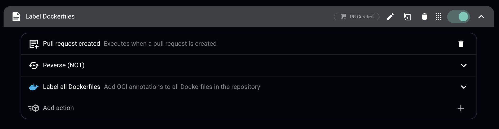

# Container Scanning 1 - Dockerfile Line-Based Scanning Demo

This repository demonstrates **Arnica's line-by-line Dockerfile content scanning** for Python-based containers.

## Files to Copy to Your Destination Repository

```bash
.gitignore
.github/
awsome-lines.Dockerfile
requirements.txt
```

## Setup Steps

### 1. Copy Files
```bash
# From this repo to your destination:
cp .gitignore /path/to/destination/repo/
cp -r .github /path/to/destination/repo/
cp awsome-lines.Dockerfile /path/to/destination/repo/
cp requirements.txt /path/to/destination/repo/
```

### 2. Push to Main
```bash
cd /path/to/destination/repo
git add .
git commit -m "Initial setup for Arnica container scanning demo"
git push origin main
```

**Note:** Verify that GitHub Actions ran successfully in the Actions tab.

### 3. Integrate with Arnica
1. Log into Arnica
2. Go to **Settings** → **Integrations** → **GitHub**
3. Add this repository
4. Wait 1-2 minutes for sync

### 4. Set Up Policy (Line-Based Scanning)
1. In Arnica: **Policies** → **Create New Policy**
2. Configure:
   - **Name**: "Dockerfile Heuristic Linking - Python"
   - **Type**: Code Risk
   - **Trigger**: On Push (real-time scanning)
   - **Scope**: Apply to `container-scanning-1` repository only
   - **Conditions**: Add file path condition for `*.Dockerfile`
   - **Actions**: Configure notifications/alerts as needed
3. Ensure the Label Dockerfiles policy is disabled



4. Save

### 5. View Results in Arnica
- **Repositories** → `container-scanning-1` → **Containers** tab
- **Findings** → Filter by `container-scanning-1`
- **Policies** → Your policy → View findings

## Policy Type
**Code Risk policy with On Push trigger** - Scans Dockerfile content in real-time on every push to detect vulnerabilities line-by-line.

---

See `container-scanning-2` for the **Pull Request labeling policy** demo.
